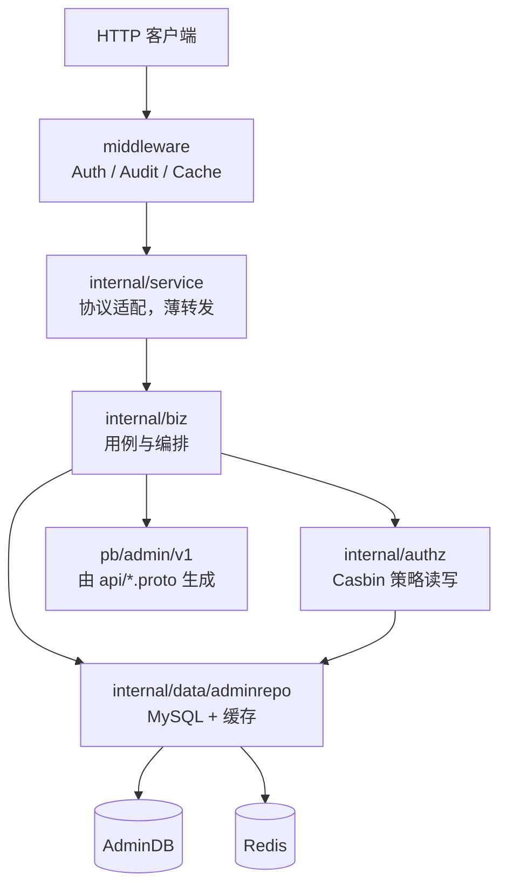

# kratos-admin

从 `mome-admin` 抽取的管理后台**权限服务**（团队 / 角色 / 菜单 / 用户 / Casbin / 审计）。不含短剧业务。

## 架构一览



**请求路径**：`Client → middleware → service → biz → (authz | adminrepo) → DB/Redis`

**约定**：`service` 只做入参/出参；完整用例在 `biz`（如 `SaveAdminUser` 含授权在 `adminuserbiz`）；`data` 只返回 `adminmodel`，树形菜单在 `permissionbiz/factory` 组装。

## 包职责

```text
kratos-admin/
├── api/admin/v1/                 # Proto 契约（permission / admin_user / error_reason）
├── pb/admin/v1/                  # 生成：HTTP·gRPC 注册、validate、错误码
├── openapi.yaml                  # make api 生成，对外路径清单
├── cmd/kratos-admin/             # main、wire 注入
├── configs/config.yaml           # MySQL、Redis、JWT、权限白名单
│
├── internal/
│   ├── server/                   # 组装 HTTP/gRPC，挂中间件与服务
│   ├── service/                  # proto 实现（薄转发）
│   │   ├── permission.go         #   PermissionService
│   │   └── adminuser.go          #   AdminUserService
│   ├── middleware/               # Auth（JWT+Casbin）、Audit、Cache、数据权限 metadata
│   ├── conf/                     # 配置结构体
│   ├── authz/                    # Casbin Store、策略域与前缀常量
│   ├── biz/                      # 用例层（一条 RPC 一个故事线）
│   │   ├── adminuserbiz/         #   登录、用户 CRUD、GetUserInfo、SaveAdminUser（含授权）
│   │   ├── permissionbiz/        #   团队、角色、菜单、用户权限
│   │   │   ├── factory/          #     model↔pb、资源树、权限树
│   │   │   └── valueobject/      #     数据隔离、资源类型、成员权限等级
│   │   └── auditbiz/             #   操作日志查询
│   └── data/
│       ├── data.go / casbin.go   #   DB、Redis、Casbin 连接
│       └── adminrepo/            #   表仓储（user / group / role / resource / operation_log）
│
└── pkg/
    ├── model/adminmodel/         # GORM 表模型、分页、UserDataPermission
    └── toolbox/                  # 内嵌通用库（datax、errorx、helpx、logx、utils、claim…）
```

## 主要 HTTP 接口

| 域 | 示例 |
|----|------|
| 用户 | `POST /v1/user/login`、`GET /v1/user/info`、`GET/POST /v1/user/list|save` |
| 权限 | `/v1/permission/group/*`、`/v1/permission/role/*`、`/v1/permission/resource/*` |
| 审计 | `GET /v1/operation/log/list` |

完整路径见根目录 `openapi.yaml`（`make api` 生成）。

## 本地运行

启动前改 `configs/config.yaml` 里的 MySQL、Redis、`security.jwt_secret`。

```bash
make init    # 首次：安装 proto / wire 插件
make all     # 生成 pb、openapi.yaml、wire，并编译
GOCACHE=/tmp/go-build go run ./cmd/kratos-admin -conf ./configs/config.yaml
```

仅重新生成 API：`make api`。

## 菜单资源（权限管理）

菜单管理数据应与 **权限管理单模块** 一致，不要导入 mome 全量 `AuthMenu`（含「基础配置」「访问管理」等）。

标准模板：`configs/permission_resources.json`（仅根节点 `permission` → 团队 / 角色 / 用户 / 菜单管理，无短剧媒资按钮）。

首次或纠正数据时：

1. 在菜单管理页删除错误的根菜单（如「基础配置」「管理后台设置」等）
2. 使用前端「标准模板」或导入上述 JSON（`admin-frontend/public/permission_resources.json` 与 configs 同步）
3. 为超级管理员角色勾选新菜单权限
